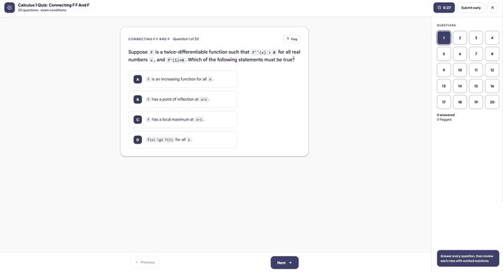

# StudySnap AI

  
  <h2>Capture, understand and study with AI</h2>
  

Estensione Chrome per analizzare pagine, esercizi, testo e immagini con un provider AI.
Pensata anche per supportare lo studio senza modificare automaticamente la pagina
quando l'opzione **Auto-answer** è disattivata.

## Funzioni

- Acquisizione di un'area con `Alt+A`.
- Risoluzione strutturata di una pagina con `Alt+9`.
- Analisi di testo o immagini dal menu contestuale **Answer by StudySnap AI**.
- Supporto per Google Forms, Microsoft Forms e pagine HTML/ARIA comuni.
- Risposte nel box integrato e cronologia nel workspace.
- Compilazione automatica opzionale di radio, checkbox, select e campi di testo.
- Supporto per domande con immagini e contesti condivisi.
- Protezione dei campi Name, Class, email, matricola e simili.
- Modalità **Auto-answer** e **Panic mode** (`Alt+0`).

## Comandi

| Comando | Azione |
| --- | --- |
| `Alt+A` | Seleziona un'area e chiedi una risposta all'AI |
| `Alt+9` | Analizza la pagina e risolvi le domande rilevate |
| `Alt+0` | Attiva o disattiva la panic mode |
| Menu contestuale | Analizza testo o immagini selezionate |

## Auto-answer

- **Disattivato:** mostra la risposta senza modificare i campi della pagina.
- **Attivato:** può selezionare opzioni e compilare i campi compatibili.
- Il modulo non viene inviato automaticamente.
- I campi identificativi restano protetti.

## Provider supportati

- OpenAI
- Google Gemini
- Anthropic
- Ollama
- Server locali OpenAI-compatible, come LM Studio, Jan, GPT4All, LocalAI e vLLM

## Installazione

1. Scarica o clona il repository.
2. Apri `chrome://extensions`.
3. Attiva **Modalità sviluppatore**.
4. Seleziona **Carica estensione non pacchettizzata**.
5. Scegli la cartella che contiene `manifest.json`.
6. Configura provider, modello e API key dal popup.

Per aggiornare l'estensione, ricaricala da `chrome://extensions`.

## Release

La versione corrente è **2.0.0**.

[Scarica l'ultima release](https://github.com/sgor-ai/StudySnap-AI/releases)

## Privacy

Le impostazioni, la cronologia e le immagini salvate restano nel browser.
Il contenuto acquisito viene inviato solo al provider AI configurato.
