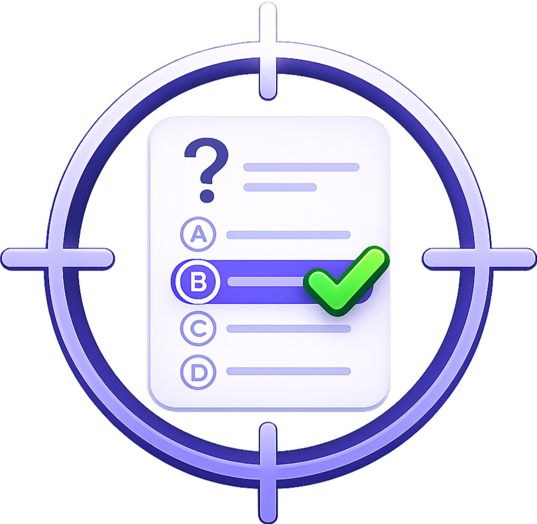
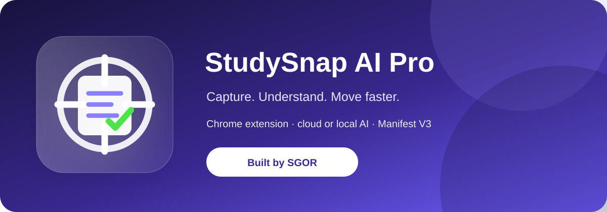
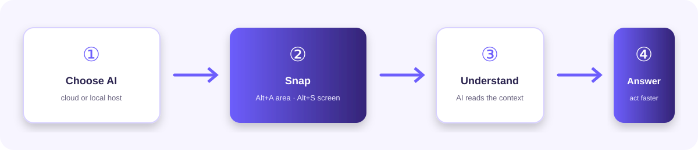
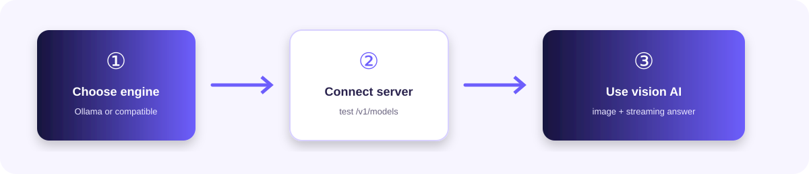

<div align="center">
  
  <h1>StudySnap AI Pro</h1>
  <p><strong>Choose your AI. Snap your screen. Understand faster.</strong></p>
  <p>Built and signed by <strong>SGOR</strong>.</p>
  <p>
    
    
    
    <a href="./LICENSE"></a>
  </p>
</div>

<div align="center">
  
</div>

## What is StudySnap?

StudySnap AI Pro is a Chrome extension for getting focused AI help from anything visible on your screen.

Capture a selected area or the visible screen, send it to the AI provider you choose, and receive a direct answer without leaving the page. Use cloud providers for convenience or local AI for private, on-device workflows.

<div align="center">
  
</div>

## Why use it?

| Choose your AI | Capture instantly | Get a useful answer |
| --- | --- | --- |
| Gemini, OpenAI, Anthropic, Ollama, LM Studio, Jan, GPT4All, LocalAI, vLLM and compatible servers | `Alt+A` for an area or `Alt+S` for the visible screen | Focused responses, follow-up chat, history and exports |

### Designed for

- Studying and understanding difficult material.
- Reading documentation and technical diagrams.
- Debugging code and error messages.
- Solving exercises from a screen capture.
- Research, writing and everyday AI-assisted work.

## Features

- **Area capture** with `Alt+A`.
- **Visible-screen capture** with `Alt+S`.
- Cloud and local AI providers in one popup.
- Native Ollama support for local vision models.
- OpenAI-compatible support for LM Studio, Jan, GPT4All, LocalAI, vLLM, llama.cpp and similar servers.
- Streamed answers in the selected language.
- Direct-answer prompt with no unnecessary digressions.
- Separate profiles for different providers, models or projects.
- Automatic fallback when a provider fails.
- Undercover and Normal answer display modes.
- Follow-up chat in the StudySnap workspace.
- Local history, cache and Markdown/PDF export.
- Panic mode with `Alt+0`.

## Install in Chrome

1. Download this repository and extract it if needed.
2. Open Chrome and go to `chrome://extensions`.
3. Enable **Developer mode**.
4. Click **Load unpacked**.
5. Select the project folder containing `manifest.json`.
6. Pin **StudySnap AI** to the Chrome toolbar.

After changing files, return to `chrome://extensions` and click **Reload** on StudySnap.

## Quick setup

1. Click the StudySnap icon.
2. Open **General settings** with the gear button.
3. Select a provider.
4. Choose or create a profile.
5. Enter the model and API key when required.
6. Click **Test connection**.
7. Click **Save settings**.
8. Open a normal webpage and press `Alt+A` or `Alt+S`.

### Gemini

1. Select **Google Gemini**.
2. Create a key at [Google AI Studio](https://aistudio.google.com/).
3. Paste it into **API Key**.
4. Leave **Model** empty to use the recommended default, or enter a supported model.
5. Test the connection and save the profile.

Never place API keys in this repository, screenshots or public messages. StudySnap stores them in Chrome extension storage on your computer.

## Local AI

Open the provider menu and select **Local host / Local AI**.

<div align="center">
  
</div>

Choose one engine:

- **Ollama** - native local API, simple setup and no API key.
- **OpenAI-compatible** - LM Studio, Jan, GPT4All, LocalAI, vLLM, llama.cpp and other compatible servers.

### Ollama

1. Install [Ollama](https://ollama.com/).
2. Download a vision model:

   ```powershell
   ollama pull llava
   ```

3. Start Ollama:

   ```powershell
   ollama serve
   ```

4. In StudySnap, select **Local host / Local AI** and **Ollama**.
5. Leave **API Key** empty.
6. Click **Test connection**, then **Save settings**.

If Chrome blocks the local request on Windows, restart Ollama with:

```powershell
$env:OLLAMA_ORIGINS="*"
ollama serve
```

The first request can take longer while the model loads into memory. StudySnap keeps the connection alive during generation.

### OpenAI-compatible servers

1. Install your preferred local AI application.
2. Download a **vision-capable model**. Text-only models cannot analyze screenshots.
3. Start its OpenAI-compatible API server.
4. Select **OpenAI-compatible** in the StudySnap local engine menu.
5. Enter the server base URL:

| Application | Common base URL |
| --- | --- |
| LM Studio | `http://localhost:1234/v1` |
| Jan | `http://localhost:1337/v1` |
| GPT4All | `http://localhost:4891/v1` |
| LocalAI | `http://localhost:8080/v1` |
| vLLM | `http://localhost:8000/v1` |

6. Enter the exact loaded model ID.
7. Leave **API Key** empty unless the server requires authentication.
8. Click **Test connection**, then **Save settings**.

The connection test checks:

```text
GET /v1/models
```

Screenshot requests use:

```text
POST /v1/chat/completions
```

The server must support streaming and image input. If authentication is enabled, StudySnap sends the local key as a Bearer token.

## Keyboard shortcuts

| Action | Windows/Linux | macOS |
| --- | --- | --- |
| Select an area | `Alt+A` | `Option+A` |
| Capture the visible screen | `Alt+S` | `Option+S` |
| Toggle Panic mode | `Alt+0` | `Option+0` |
| Cancel an active selection | `Esc` | `Esc` |

If a shortcut is already used by Chrome or another extension, change it at `chrome://extensions/shortcuts`.

## Panic mode

Panic mode is off by default.

Press `Alt+0` to:

- close every visible StudySnap answer box;
- remove an active selection overlay;
- pause new captures;
- stop the active answer connection;
- keep all settings unchanged.

Press `Alt+0` again to restore normal use. The popup header shows the state with a dot:

- dark dot: **off**;
- bright red dot: **on**.

## StudySnap workspace

Click **Open StudySnap Workspace** in the popup to:

- review previous answers;
- ask follow-up questions;
- switch profiles;
- export history as Markdown;
- print history to PDF;
- change the workspace theme.

## Troubleshooting

| Problem | What to check |
| --- | --- |
| A shortcut does nothing | Use a normal webpage, reload the extension and check `chrome://extensions/shortcuts`. Chrome internal pages and some PDF viewers cannot be scripted. |
| Gemini, OpenAI or Anthropic fails | Check the API key, model name, account quota and provider status. |
| Ollama is unreachable | Confirm `ollama serve` is running and retry with `OLLAMA_ORIGINS=*` if Chrome blocks localhost. |
| A local server is unreachable | Check the application, port, `/v1` suffix and **Test connection**. |
| The model cannot understand the image | Load a vision-capable model, not a text-only model. |
| The first local answer is slow | The application may be loading the model into memory. Wait for the first response. |
| The connection is interrupted | Reload the extension, keep the server running and confirm that it supports streaming. |
| The answer is incomplete | Check the provider logs and confirm that the server returns valid SSE or Ollama JSON-line output. |

Requests that receive no response are stopped after 10 minutes.

## Privacy

StudySnap does not include its own AI model. Captured images and prompts are sent to the provider selected in settings.

- Cloud providers process data under their own terms.
- Ollama and other local servers can keep inference on your computer.
- API keys remain in Chrome extension storage and are not included in the project files.
- Do not capture passwords, private keys, confidential customer data or anything you are not allowed to share.

AI answers may be incomplete or incorrect. Verify important academic, technical, legal and safety-critical information.

## License

StudySnap AI Pro is released under the [MIT License](./LICENSE).

<div align="center">
  <strong>StudySnap AI Pro - built for practical, clear and fast AI-assisted work.</strong><br>
  <strong>SGOR</strong>
</div>
