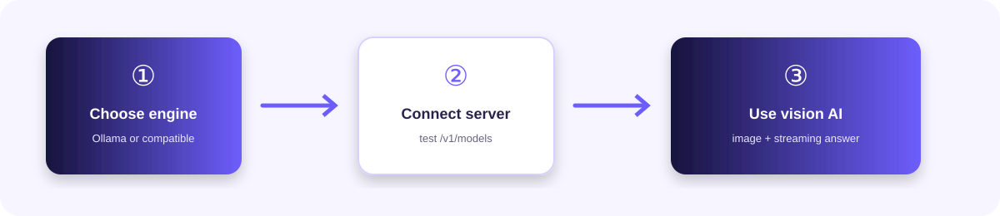
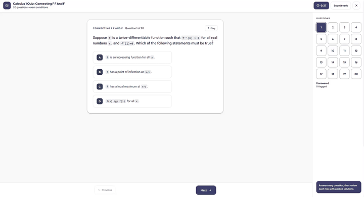
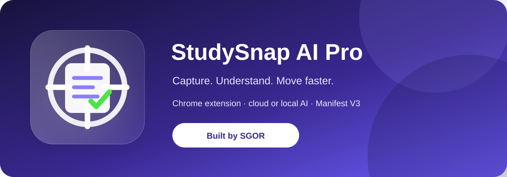

# StudySnap AI

  
  <h2>Capture, understand and study with AI</h2>
  
  

A Chrome extension for analyzing webpages, exercises, text and images with an AI provider.
It can also assist with study forms without changing the page when **Auto-answer** is disabled.

## Features

- Capture an area with `Alt+A`.
- Solve a structured page with `Alt+9`.
- Analyze selected text or images from the **Answer by StudySnap AI** context menu.
- Support for Google Forms, Microsoft Forms and common HTML/ARIA pages, including accessible embedded frames. Chrome internal pages and frames blocked by browser or site policies are not accessible.
- Answers in the in-page box and workspace history.
- Optional filling of radio buttons, checkboxes, selects and text fields.
- Support for image-based questions and shared context.
- **Auto-answer** and **Panic mode** (`Alt+0`).

## Shortcuts

| Shortcut | Action |
| --- | --- |
| `Alt+A` | Select an area and ask the AI |
| `Alt+9` | Analyze the page and solve detected questions |
| `Alt+0` | Enable or disable panic mode |
| Context menu | Analyze selected text or images |

See the [workflow diagram](./docs/workflow.svg) for an overview of the capture and answer flow.

## Demo

Watch the [demo video](./docs/video.mp4) or view the animated demo above.

## Auto-answer

- **Disabled:** shows the answer without changing page fields.
- **Enabled:** can select options and fill compatible fields.
- The form is never submitted automatically.
- Identity fields remain protected.

## Supported providers

- OpenAI
- Google Gemini
- Anthropic
- Ollama
- OpenAI-compatible local servers such as LM Studio, Jan, GPT4All, LocalAI and vLLM

## Installation

1. Download the source code ZIP from the [StudySnap AI 1.0.0 release](https://github.com/sgor-ai/StudySnap-AI/releases/tag/v1.0.0).
2. Extract the ZIP.
3. Open `chrome://extensions` and enable **Developer mode**.
4. Select **Load unpacked** and choose the extracted folder containing `manifest.json`.
5. Configure the provider, model and API key in the popup.

Reload the extension from `chrome://extensions` after updating it.

## Release

Current version: **1.0.0**.

[Download the latest release](https://github.com/sgor-ai/StudySnap-AI/releases)

## Privacy

Settings, history and saved images remain in the browser.
Captured content is sent only to the configured AI provider.
